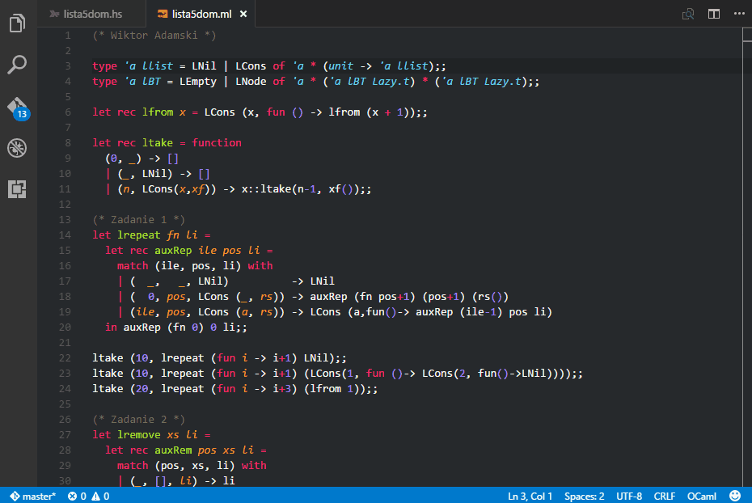

# Ocaml tuareg-master README

## Prequisites

* Installed **OCaml** exstension by hackwaly
* ocaml installed and set in path

## Features



Tuareg-master interactive mode for OCaml. Zdzisław Spławski style ;)

Plug-in adds following shortcuts by default:
* **ctrl+k ctrl+o** - open OCaml in integrated terminal
* **right alt+/** - send statement the cursor is on to ocaml

## Known Issues

Currently extension does not correctly recognize multiple statements ending on the same line, for example:
```ocaml
let filter f li = List.fold_right (fun x acc -> if f x then x :: acc else acc) li [];;

filter (fun x -> x mod 2 = 0) [1;2;3;4;5;6;7];;filter (fun x -> x mod 2 = 0) [];;
````

The extension doesn't respect comments either, it will send commented-out code.

## Release Notes

### 1.0.0

Initial release of tuareg-master

-------------------------------------------------------------

**Enjoy!**